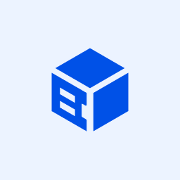
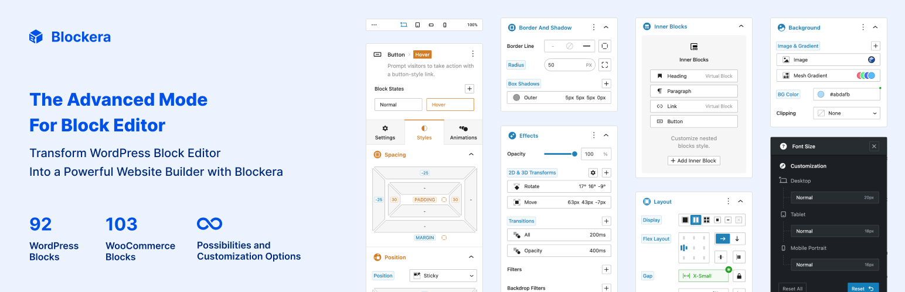

<h1 align="center">Blockera One</h1>
<h3 align="center">The Only Block Theme You’ll Ever Need</h3>

	<a href="https://blockera.ai">🌐 Blockera Website</a> · <a href="https://wordpress.org/plugins/blockera/"> Download Plugin</a>

 
 
  
 
 
 

